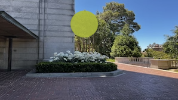

# UNet


The original U-Net paper:
> Ronneberger, et al. ["U-Net: Convolutional Networks for Biomedical Image Segmentation."](https://link.springer.com/chapter/10.1007/978-3-319-24574-4_28) MICCAI 2015.


### Facts about UNet:
1. Symmetrical, skip connection to both reconstruct the pixels and enhance the gradient flow.
2. Inside each block, we have three residual sub-blocks that maintain the photo resolution.
3. Various layers can be formulated by `F(X) + X`.  Trivially `F` can be zero, then only skip connection is passed to subsequent layers. Similar to ResNet,  
   it allows for deeper neural networks.
4. Photo resolution (H and W) down and up, channel resolution (C) up and down.
5. Resampling with convolution, to make network size independent of input size, and to save on the total number of parameters. 
(It does away with fully connected layers).
6. Extreme care for resolution changes:
   1. use mirrored padding in convolution;
   2. bilinear upsampling.
   
### Sample input and output

Images with square or circular overlays are restored. 

<div style="display: flex; justify-content: space-between;">
  
  
</div>

<div style="display: flex; justify-content: space-between;">
  
  
</div>
   
### Setup

```bash
$ git clone https://github.com/yeyewangwang/unet_image_restoration.git
$ cd unet_image_restoration
$ pip install -r requirement.xt
```

### Train a model
```bash
# Check the help message
$ python3  train.py --help
usage: train.py [-h] [--batch_size BATCH_SIZE] [--epochs EPOCHS] [--lr LR]
                [--dataset_dir DATASET_DIR] [--checkpoint_dir CHECKPOINT_DIR]
                [--checkpoint_interval CHECKPOINT_INTERVAL] [--resume]
                [--resume_path RESUME_PATH]

PyTorch Unet Trainer

optional arguments:
  -h, --help            show this help message and exit
  --batch_size BATCH_SIZE
                        Input batch size for training
  --epochs EPOCHS       Number of epochs to train
  --lr LR               Learning rate
  --dataset_dir DATASET_DIR
                        Path for input dataset
  --checkpoint_dir CHECKPOINT_DIR
                        Directory to save checkpoints
  --checkpoint_interval CHECKPOINT_INTERVAL
                        How many batches to wait before creating a checkpoint and computing
                        validation accuracy for the small dataset.
  --resume              If selected, resume training from checkpoint
  --resume_path RESUME_PATH
                        Path to the checkpoint to resume from
```

### Evaluate a trained model
Suppose a pretrained model checkpoint is stored at `MODEL_CHECKPOINT`.

```bash
$ python run_validation.py  --model_checkpoint MODEL_CHECKPOINT --data_dir DATA_DIR --output_dir OUTPUT_DIR
```

### Work in Progess

* Use image resolution that is multiple of the spatial compression factor.
   
   This is a potential method to reduce irregularities from image resolution change. 


[comment]: <> (### Implementation details)

[comment]: <> (#### Technique to recover from C // 2 to C)
